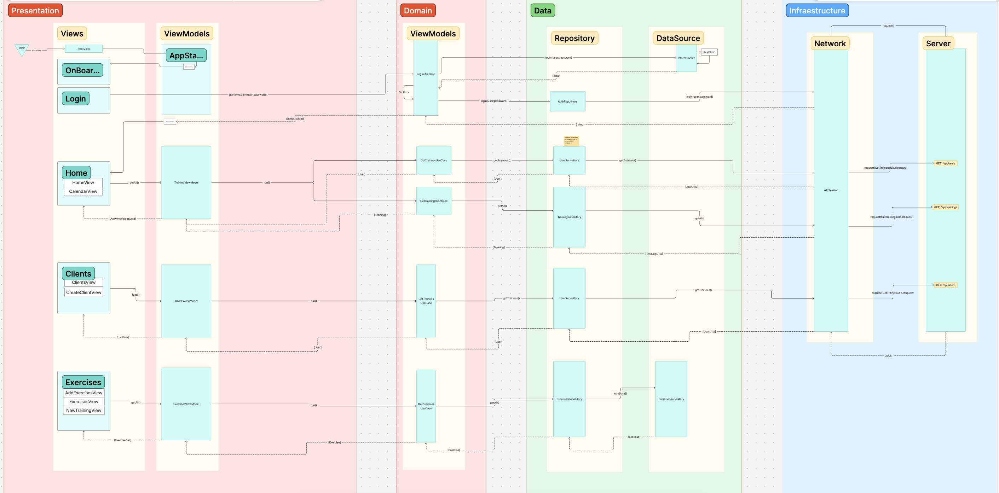
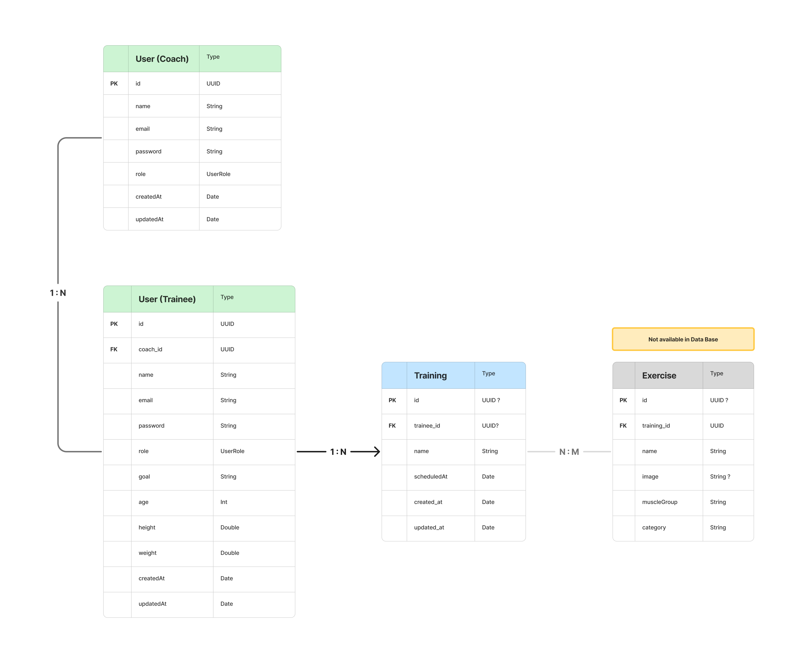

## :bicyclist: FitTrack :runner:

### ¿Que es FitTrack?

FitTrack es una plataforma diseñada para la creación y gestión de rutinas personalizadas.

Esta plataforma te permite registrar a todos los usuarios de tu gimnasio, clínica o box, asignarles rutinas y/o entrenamientos y centralizar toda su información en un único lugar, lo que facilitará el seguimiento y la progresión de tus deportistas.

### Objetivos de este proyecto 

Esta aplicación se centra en el coach como protagonista, ofreciondo los siguientes puntos:

1. Gestión de clientes: cada coach puede organizar y administrar a todos sus clientes. En una única plataforma dispondrá de los entrenamientos realizados, las métricas y los objetivos.

2. Seguimiento personalizado: poder acceder al historial de entrenamientos, los progresos de los ejercicios y los marcajes de estos 

### ¿Cómo funciona? :iphone:

1. Al iniciar la aplicación encontrarás un menú donde podrás elegir entre iniciar sesión si ya tienes una cuenta creada o registrarse, donde tendrás que añadir tu nombre, tu email y una contraseña.

2. Ambos pasos te llevarán a la pantalla de Home, donde podrás visualizar los próximos entrenamientos que tienes programados con tus clientes, así como:

	- Crear un cliente nuevo: Se facilitará un formulario mas extenso donde se rellenarán métricas, se planteará un objetivo, se reflejará un historial y el nivel actual. 

	- Crear un entrenamiento nuevo: Se mostrará una pantalla donde se seleccionará un cliente, se planteará el objetivo del entrenamiento, se seleccionará la fecha y hora y se confeccionarán los ejercicios.

		-Ejercicios: Al seleccionar ejercicios, se mostrará una pantalla donde aparecerán los ejercicios elegidos a partir del botón "Añadir ejercicios", el cual mostrará el listado de ejercicios disponibles. 
		Podrás confeccionar el numeros de series, el peso, las repeticiones de cada serie y el tiempo estimado. 

	Una vez seleccionado todo, pulsa el botón crear para observar el entrenamiento en la home. 
  
	- Visualizar el calendario completo pulsando en el icono.

	- Visualizar tu perfil pulsando en el icono con tu foto (pendiente de implementar).

3. A parte, desde el momento en que inicies sesión, habrá una tabBar donde podrás visualizar:
	
	-Clientes: Listado de clientes donde poder seleccionar y consultar los datos de cada uno (pendiente de implementar).

	- Ejercicios: Listado de ejercicios por orden alfabético, donde podrás seleccionar y ver en detalle como se realiza cada uno. (Pendiente de implementar).

### Tecnologías utilizadas :clipboard:

- Lenguaje empleado: Swift 

- Framework SwiftUI 

- Arquitectura CLEAN

- Patrón MVVM (Model-View-ViewModel)

- Server creado en Vapor + Fluent 


## Estructura del proyecto 

### Arquitectura

Nuestra arquitectura sigue los principios de **Clean**, en la capa de presentación usamos **MVVM**, junto con el patrón **Repositorio** para desaclopar datos. Básicamente separamos el código en 4 capas: `Presentation`, `Domain`, `Data` e `Infraestructura`. Esta última siendo la capa más externa que define cómo llegan los datos del exterior.

```
Project/
├── Infraestructre/
│   ├── Requests/
│   ├── Networking/
├── Domain/
│   ├── Entities/
│   ├── UseCases/
├── Data/
│   ├── Repositories/
│   ├── DataSources/
│   ├── DTOs/
│   ├── Mappers/
└── Presentation/
    └── ViewModels
    └── Views
```

### Diagrama de sequencia


## El Server

La comunicación con el servidor se logra a través de un backend desarrollado en **Vapor**. La app consumen un **API REST** local y la base de datos se maneja con **Fluent**, lo que facilita la comunicación entre capas y asegura consistencia.

### Diagrama de entidad y relaciones
